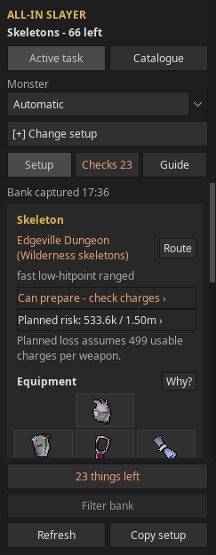
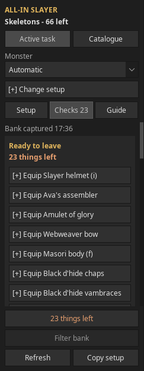
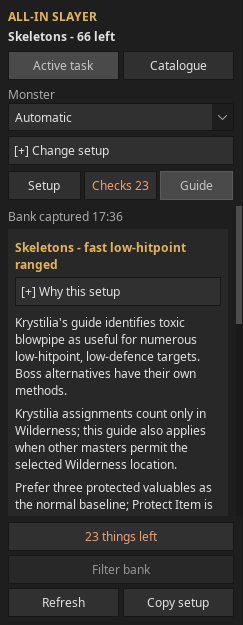

# All-In Slayer


Plan your next Slayer trip with the gear you own. All-In Slayer brings master
assignments, monster variants, locations, equipment, supplies and preparation
checks into one RuneLite sidebar.

**Pre-release:** this plugin has not been submitted to or approved for the
RuneLite Plugin Hub. Follow the [release tracker](docs/plugin-hub-readiness.md)
for verification evidence and publication progress.

## Start a trip

1. Open your bank to capture your equipment and supplies. Before the first scan,
   advice uses only your inventory and worn gear. Bank observations are stored
   per RuneScape account; reopen the bank to refresh an older observation.
2. Use **Active task** for your assignment, or **Catalogue** to browse tasks,
   variants and locations. Catalogue assumes you are on task for planning and
   labels the result as a preview.
3. Review **Setup** for the destination, owned equipment and inventory plan.
   Use **Change setup** to compare methods and locations. Wilderness advice
   requires explicit opt-in; travel through the Wilderness also counts.
4. Open **Checks** for anything still needed: items to equip or withdraw,
   account requirements, charges and Wilderness risk. Known confirmations are
   hidden; missing or unknown information stays visible.
5. With your bank open, use **Filter bank** to arrange the recommended equipment
   and inventory for gearing. Withdraw, equip and travel yourself.

## What the panel does

| Feature | What you get |
| --- | --- |
| Task and monster catalogue | Master assignments, boss variants, locations and alternative strategies |
| Bank-aware equipment | Wiki priorities matched against usable owned gear, with missing items and fallbacks explained |
| Trip inventory | Food and style-specific boost preferences, rune pouch plans, supplies, return teleports and Wilderness escapes |
| Ready to leave | A comparison with what you actually wear and carry, plus outstanding account and preparation checks |
| Wilderness preparation | Protected-item estimates, extra carried risk, weapon ether and looting-bag observations |
| Guide | Strategy context, equipment reasoning, travel and original Wiki sources |

| Setup and destination | Outstanding preparation | Strategy context |
| --- | --- | --- |
|  |  |  |

These are real panel captures from the development client. Values depend on the
selected setup and account observations; an example screenshot is not a claim
that every preparation check has been completed. See the
[detailed user guide](docs/user-guide.md) for settings, charge semantics, bank
layouts, teleport choices and limitations.

## Integrations

- **Shortest Path** is optional. **Route** sends a destination using its supported
  plugin-message interface. Its account unlocks, transport settings, house
  configuration and available items determine routing. AIO reports **Route sent**;
  inspect Shortest Path for the result. AIO preserves routes set by other sources.
- **Weapon Charges** is optional. AIO reads its estimates and also records your
  own in-game Check observations. Unavailable balances remain unknown. Usable
  Wilderness weapon charges exclude the 1,000 activation ether.
- **Bank Tags** is RuneLite's built-in dependency for the temporary bank filter.
  Saved tags and layouts are preserved; **Clear bank filter** restores the view.
- **Inventory Setups** is optional. **Copy setup** produces an import string for
  you to import yourself.

## Limits

The plugin is a passive advisor. It never performs game actions, switches gear,
generates input, or provides live combat prayer/tile prompts. It bundles its
Slayer data and makes no runtime Wiki requests or custom HTTP data collection.

Recommendations follow documented strategy priorities and account observations;
they are not measured DPS, XP/hour or GP/hour predictions. Closed-bank stock can
be stale. Unsupported requirements, unknown charges and incomplete strategy
information remain unresolved rather than proving a trip ready. Review the
[source coverage](docs/reconstruction/data-coverage.md) and original Wiki guides.

## Build and manual verification

Clan testers can [download the Windows preview ZIP](https://github.com/danieljglover/AIO-Slayer-Assistant/raw/refs/heads/main/downloads/aio-slayer-windows-preview-f1bfd33.zip)
without building from source. This older preview predates the current Hub-readiness
changes. Extract the entire ZIP and follow `READ-ME-FIRST.txt`,
then run `Start-AIO-Slayer.bat`. This preview contains source revision `f1bfd33`;
its [SHA-256 checksum](downloads/aio-slayer-windows-preview-f1bfd33.zip.sha256)
is included for verification. Windows launch still needs tester verification.

Use the checked-in Gradle wrapper with JDK 11 or newer:

```sh
./gradlew build
./gradlew generateSlayerData
./gradlew run
```

`build` generates the bundled catalogues from `src/main/data/slayer` before
packaging. Authoring compilers live in the separate `dataGenerator` source set;
their classes are excluded from the runtime JAR. See the
[source and build reference](docs/agents/slayer-data-source.md#compiler-source-set).
Keep `build=gradle` in `runelite-plugin.properties`: the Plugin Hub must use our
build script to generate these resources. Its `standard` mode replaces the
Gradle scripts and would discard the catalogue-generation tasks.

On Windows, open PowerShell in the repository folder and use:

```powershell
.\gradlew.bat build
.\gradlew.bat run
```

`run` opens RuneLite with AIO loaded and uses your own RuneLite profiles and Hub
plugins. For a Jagex Account, complete the one-time login setup in the
[Windows guide](packaging/windows/READ-ME-FIRST.txt), based on
[RuneLite's official instructions](https://github.com/runelite/runelite/wiki/Using-Jagex-Accounts).
Account credentials stay on your computer and must never be committed or shared.

The plugin targets Java 11 bytecode. This project deliberately has no automated
tests, test files, or testing dependencies. Compilation and source validation are
followed by manual checks in RuneLite. See the
[manual verification record](docs/reconstruction/verification.md).

The existing local Jagex launcher helpers remain in `scripts/`. Their session
file, `scripts/.jagex-env`, must stay local and is never part of the plugin or
source-data tooling.

For a Windows clan preview, run `./gradlew windowsPreviewZip`. Share only the ZIP
under `build/distributions/`. It contains the plugin, its existing development
launcher, intact runtime dependency JARs, a Windows batch launcher and
[tester instructions](packaging/windows/READ-ME-FIRST.txt). Testers need Java
11+ (the launcher can use RuneLite's bundled Java), but no build tools. Jagex
Accounts use RuneLite's documented local development-login setup. Personal
profiles, session files, repository scripts and other development plugins are
excluded. Rebuild and redistribute after incompatible game/client updates.
After an update, use `./gradlew --refresh-dependencies windowsPreviewZip` (Windows:
`.\gradlew.bat --refresh-dependencies windowsPreviewZip`) so Gradle checks the
current RuneLite release instead of reusing its cached dynamic-version result.
Check `BUILD-INFO.txt` in the ZIP for the included client version. Use the same
`--refresh-dependencies` flag with `run` when updating a local development client.

## Architecture

- `AllInSlayerPlugin`: lifecycle, event coalescing, background computation, and EDT publication.
- `bank/advisor`: account-scoped inventory, equipment, bank, skill, and quest snapshots.
- `task/advisor`: active assignment and location-table resolution.
- `model/advisor`: catalogue and immutable recommendation request/result snapshots.
- `loadout/advisor`: eligibility, equipment dependencies, inventory planning, and ranking.
- `ui/advisor`: native Swing catalogue/task panel and optional passive overlay.
- `src/dataGenerator/java/.../data/source`: build-only source compilation and validation.
- `integration/advisor`: explicit clipboard export for Inventory Setups.

Historical design documents describe superseded implementations. The current
[reconstruction contract](docs/reconstruction/implementation.md) and code define
the new implementation.

## License

Plugin code is [BSD 2-Clause](LICENSE). Adapted OSRS Wiki text retains its
[CC BY-NC-SA 3.0](https://creativecommons.org/licenses/by-nc-sa/3.0/) license,
subject to source-specific exceptions and the
[Wiki's additional terms](https://meta.weirdgloop.org/w/Licensing).

The runtime JAR includes the code license, Wiki attribution and CC license,
and the Weapon Charges mapping notice under `META-INF/`. Source article URLs
and revision evidence remain in the bundled data. See the
[attribution notice](src/main/resources/META-INF/NOTICE.txt). Game artwork and
trademarks remain with their respective rights holders.

Unofficial fan project, not affiliated with Jagex or the RuneLite developers.
