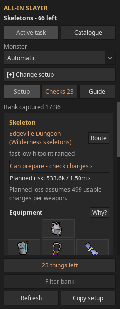
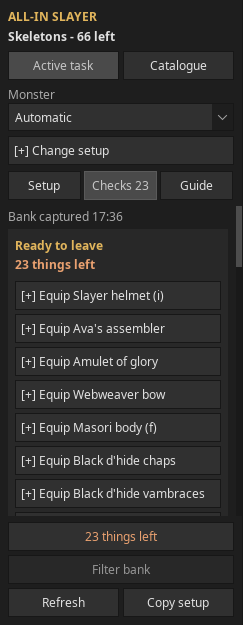
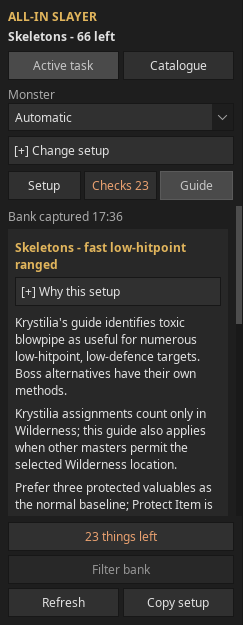

# All-In Slayer


All-In Slayer is a Slayer trip planner that lives in the RuneLite sidebar. It
reads your task and the gear you own, then suggests where to go, what to wear,
what to pack and what is still missing before you leave the bank.

It is built on OSRS Wiki strategy guides and covers ten Slayer masters, from
Turael and Spria to Duradel, Konar and Krystilia, including boss tasks and
Wilderness assignments. The plugin only gives advice: you withdraw, equip and
travel yourself.

| Setup and destination | Outstanding preparation | Strategy context |
| --- | --- | --- |
|  |  |  |

Screenshots are real panel captures. Your values depend on your task, account
and bank.

## Features

- **Task-aware.** Reads your current assignment and remaining kill count,
  including boss tasks and Konar location restrictions.
- **Gear you own.** Picks the best wiki-recommended item you own for each
  slot. If you are missing one, it uses a suitable owned fallback and says so.
  Slayer helmet and Salve amulet bonuses are compared properly; they never
  stack.
- **Complete inventory plan.** Food, potions, runes and rune pouch contents,
  switches, task items, return teleports and Wilderness escapes, showing what
  you already carry, what to withdraw and what is missing.
- **Browse anything.** The Catalogue lets you explore any master, assignment,
  monster variant, location and strategy without being on that task.
- **Ready to leave.** Compares the plan with what you are actually wearing and
  carrying, and lists what is left to do.
- **Bank filter.** Lays out the recommended gear and inventory inside your open
  bank so gearing up takes seconds.
- **Account checks.** Quests, achievement diaries, skill levels, spellbook and
  other supported unlocks are checked automatically where the game exposes
  them. Anything else can be confirmed by hand.
- **Wilderness planning (opt-in).** Estimates what you would lose on death,
  keeps trips within a loss budget you choose and tracks weapon charges and
  looting bag contents.
- **Works with your plugins.** Optional hand-offs to Shortest Path, Inventory
  Setups and Weapon Charges.

## Getting started

1. Install **All-In Slayer** from the RuneLite Plugin Hub and open the
   **All-In Slayer** sidebar panel.
2. **Open your bank once.** This is how the plugin learns what you own. Until
   then it only knows your worn gear and inventory. It remembers the last bank
   view per account; reopen the bank after buying or using items.
3. Get a task, or use **Catalogue** to plan one you do not have yet.
4. Read **Setup** for the destination, gear and inventory. Use
   **Change setup** to try another location, method or goal.
5. Open **Checks** for anything still needed before you leave.
6. With your bank open, press **Filter bank**, withdraw and equip, then check
   **Ready to leave**.

## Panel guide

| View or control | What it does |
| --- | --- |
| **Active task** | Your current assignment, remaining count and the recommended setup. |
| **Catalogue** | Search masters and assignments; explore variants, locations and methods. Results are labelled **On-task preview** because they assume you have that task. |
| **Setup** | Destination, equipment, compact inventory and packing list. |
| **Checks** | Items to equip or withdraw, account requirements, charges and death risk. Rows expand for detail. |
| **Guide** | Strategy notes, why each item was picked, travel and access, other setups and links to the original Wiki pages. |
| **Change setup** | Choose location, method, master, recommendation goal, return destination, and whether Wilderness and group methods are allowed. |
| **Route** | Sends the selected destination to the **Shortest Path** plugin. **Clear** removes it. |
| **Copy setup** | Copies an **Inventory Setups** import string to your clipboard. |
| **Filter bank** | Shows the setup in your open bank: equipment on the left, the 28 inventory slots on the right, rune pouch contents below. Missing items appear faded. **Clear bank filter** restores your normal bank. |
| **Ready to leave** | Compares the plan with what you wear and carry. Click **N things left** to see the remaining steps. |

### Recommendation goals

Choose **Slayer XP**, **Profit** or **Low effort**. Methods and locations are
ranked for that goal, and the panel explains the order. These are rankings,
not XP/hour or GP/hour predictions.

### Wilderness and group content

Wilderness and group methods are always visible, but they are only
recommended if you turn on **Include Wilderness** or **Include group methods**.
That includes routes that pass through the Wilderness.

With Wilderness enabled, the plugin:

- estimates what you would keep and lose on death, including Protect Item
  cases, repair fees and untradeables that would be lost permanently;
- only picks setups automatically when their estimated loss fits your
  **Wilderness loss budget** without Protect Item and nothing untradeable
  would be lost permanently;
- plans ether for Wilderness weapons (chainmaces, Craw's bow or Webweaver bow,
  Thammaron's or Accursed sceptre) and warns if a weapon carries more charges
  than your limit;
- considers blighted supplies, spell sacks and your looting bag.

Unknown prices or charges are shown as unknown, never counted as zero. The
in-game **Items Kept on Death** screen is still the final word.

## Settings

| Setting | Default | Notes |
| --- | --- | --- |
| Recommendation goal | Slayer XP | Slayer XP, Profit or Low effort. |
| Include Wilderness | Off | Allows Wilderness recommendations, including for Wilderness tasks. |
| Include group methods | Off | Allows methods that need a partner or team. |
| Wilderness loss budget (gp) | 500,000 | Highest estimated loss allowed without relying on Protect Item. |
| Planned ether charges | 500 | Usable charges to prepare per Wilderness weapon, on top of its 1,000 activation ether. |
| Show task overlay | On | Small overlay with your task and selected method. |
| After task | Slayer master | Packs an owned teleport back to your master, a bank or your house. |
| Wildy charge limit | 500 | Warns when a weapon holds more usable charges than this. |
| Melee / Ranged / Magic boosts | 0 slots | Reserves slots for potions in your priority order, for example `Super combat potion, Combat potion`. 0 lets the plugin decide. |
| Food: Override food | Off | Uses your own food list, for example `Shark, Cooked karambwan`, instead of automatic food. |

Required strategy items always take priority over boost and food reservations.
Missing boosts or food leave marked empty slots and show up in **Checks**.

## Works with other plugins

All of these are optional apart from Bank Tags, which is built into RuneLite.

- **Bank Tags** (built into RuneLite) powers **Filter bank**. It is turned on
  together with All-In Slayer. Your saved tags and layouts are not changed.
- **[Shortest Path](https://runelite.net/plugin-hub/show/shortest-path)**:
  **Route** sends the destination through Shortest Path's plugin-message
  interface, the same way Quest Helper does. Shortest Path uses its own
  settings, unlocks and teleports to find the route.
- **[Inventory Setups](https://runelite.net/plugin-hub/show/inventory-setups)**:
  **Copy setup** produces an import string. You import it yourself.
- **[Weapon Charges](https://runelite.net/plugin-hub/show/weapon-charges)**:
  if installed, its charge estimates appear in **Checks**. Without it, using
  **Check** on a weapon in game, or opening your looting bag, still records
  what it holds.

## Privacy and game rules

- **Advice only.** No game actions, no automated clicks or input, no equipment
  switching and no live prayer or tile prompts during combat.
- **No network requests of its own.** All Slayer data is bundled with the
  plugin. Item prices come from RuneLite's built-in price data.
- **Your data stays in RuneLite.** Your last bank view and any requirements
  you confirm by hand are saved in your RuneLite settings for each RuneScape
  account, like any other plugin setting.

## Accuracy and limits

- Strategies, gear priorities and requirements come from the OSRS Wiki and are
  bundled with each release. After a game update, advice can be out of date
  until the plugin is updated.
- Your bank is only seen while it is open, so a stored bank view can be stale.
- Some requirements and item charges cannot be read from the game. They stay
  listed as unconfirmed, and the plugin does not treat the trip as ready.
- Gear comparisons are relative stat estimates, not measured DPS.

Detailed behaviour, including charge rules, bank layouts and teleport choices,
is in the [user guide](docs/user-guide.md). The
[data coverage report](docs/reconstruction/data-coverage.md) lists what the
bundled data covers and any known gaps.

## Feedback and bug reports

Open an issue on
[GitHub](https://github.com/danieljglover/AIO-Slayer-Assistant/issues). It
helps to include your task, the selected location and method, what you
expected and a screenshot of the panel.

## For developers

### Technology

- Java 11, RuneLite client API (`compileOnly`), Swing UI, Lombok, Gson.
- Plugin class: `com.danieljglover.allinslayer.AllInSlayerPlugin`.
- Declares `@PluginDependency(BankTagsPlugin.class)` and uses
  `BankTagsService` for the bank filter.
- Built by the Plugin Hub with `build=standard`, so it has no third-party
  runtime dependencies.

### Architecture

| Package (`com.danieljglover.allinslayer`) | Responsibility |
| --- | --- |
| `AllInSlayerPlugin` | Lifecycle, event coalescing, background recomputation and publishing results on the Swing thread. |
| `bank.advisor` | Per-account snapshots of inventory, equipment, bank, skills, quests and death state. |
| `task.advisor` | Active assignment, boss task and location restriction lookup from game tables. |
| `data` | Loads and indexes the bundled catalogue. |
| `model`, `model.advisor` | Catalogue models and immutable recommendation request and result snapshots. |
| `loadout.advisor` | Eligibility, equipment selection and dependencies, inventory packing and ranking. |
| `ui.advisor` | Sidebar panel and optional overlay. |
| `integration.advisor` | Bank filter, Shortest Path, Weapon Charges and Inventory Setups hand-offs. |

Game-state reads happen on the client thread. Recommendations are computed in
the background from immutable snapshots and published to the Swing thread.

### Slayer data pipeline

The Slayer knowledge is a normalised JSON source graph in
`src/main/data/slayer/`:

| Folder | Contents |
| --- | --- |
| `masters/` | Slayer masters (10) |
| `tasks/` | Assignments, requirements and links to variants and locations (118) |
| `monsters/<family>/` | One file per combat variant (388) |
| `locations/` | Location flags and access notes (321) |
| `strategies/<id>/strategy.json` | Wiki strategy methods, gear and style options (175) |
| `weapons/`, `items/`, `rewards/`, `advisor/` | Item ID mappings, Slayer rewards and reviewed advisor rules |

Files reference each other by stable, lowercase, hyphenated IDs. At build time,
the `dataGenerator` source set validates every ID and cross-reference and
compiles the graph into `src/main/resources/data/advisor-catalogue.json`. That
file is committed because the Hub's standard build packages resources as
committed. The generator classes are not included in the plugin JAR.

Content is checked against the OSRS Wiki MediaWiki API, and source URLs and
revision IDs are recorded. See the
[data source reference](docs/agents/slayer-data-source.md) and
[Wiki workflow](docs/agents/osrs-wiki-source.md).

### Build and run

Requires JDK 11 or newer. Use the included Gradle wrapper:

```sh
./gradlew build               # compile and refresh the bundled catalogue
./gradlew generateSlayerData  # validate and compile Slayer data only
./gradlew run                 # start RuneLite with the plugin loaded
```

On Windows, use `.\gradlew.bat` instead of `./gradlew`. To log in with a Jagex
Account from a development client, follow
[RuneLite's Jagex Account guide](https://github.com/runelite/runelite/wiki/Using-Jagex-Accounts).
Never commit credentials or session files.

### Contributing

- Edit Slayer data in `src/main/data/slayer/`, never the generated catalogue.
  Run `./gradlew build` and commit the refreshed catalogue with your change.
- Follow [Jagex's third-party client guidelines](https://secure.runescape.com/m=news/third-party-client-guidelines?oldschool=1)
  and RuneLite's [rejected features list](https://github.com/runelite/runelite/wiki/Rejected-or-Rolled-Back-Features).
  This project also keeps to advice only: no automation, input generation or
  runtime data downloads.
- There is no automated test suite. Changes are checked by compiling,
  validating the data and testing manually in RuneLite; see the
  [verification record](docs/reconstruction/verification.md).
- The current design is described in the
  [implementation notes](docs/reconstruction/implementation.md). Older design
  documents describe earlier versions.

## License

Plugin code is licensed under [BSD 2-Clause](LICENSE). Text adapted from the
OSRS Wiki is licensed under
[CC BY-NC-SA 3.0](https://creativecommons.org/licenses/by-nc-sa/3.0/), subject
to the [Wiki's licensing terms](https://meta.weirdgloop.org/w/Licensing).
Source article URLs and revisions are kept in the bundled data. The plugin JAR
includes these licences and the Weapon Charges mapping notice under
`META-INF/`; see the [attribution notice](src/main/resources/META-INF/NOTICE.txt).

Unofficial fan project. Not affiliated with Jagex or the RuneLite developers.
Game artwork and trademarks belong to their respective owners.
